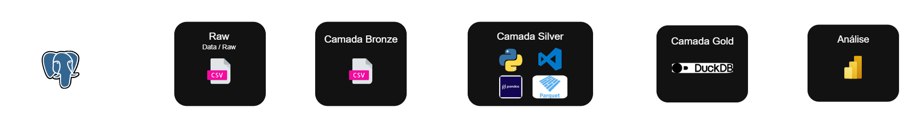

# 🏦 AlphaBank - Database Architecture & Medallion Data Pipeline


-PostgreSQL-blue)


## 📌 Sobre o Projeto
O **AlphaBank** é um projeto de Engenharia de Dados focado no design, implementação e consumo de um ecossistema bancário completo. O objetivo é simular um ambiente transacional real (OLTP no PostgreSQL) e construir uma pipeline de dados ponta a ponta utilizando a **Medallion Architecture** (Bronze, Silver e Gold) para alimentar camadas de analytics em alta performance.

---

## 🎯 Regras de Negócio e Arquitetura

O sistema do **AlphaBank** foi projetado para atender aos seguintes pilares operacionais:

- **Especialização de Clientes:** Segregação rígida entre Pessoa Física (CPF) e Pessoa Jurídica (CNPJ).
- **Contas Conjuntas vs. Salário:** Suporte a múltiplos titulares para Contas Correntes/Poupança e trava de titularidade única (PF) vinculada a empregador (PJ) para Conta Salário.
- **Rastreabilidade de Crédito & Liquidação:** Encadeamento completo de Empréstimos, Parcelas, Faturas e Boletos com liquidação atrelada ao Core Banking.
- **Governança & Analytics:** Tabela de fechamento de `saldo_diario` para otimização de consultas analíticas e trilha de auditoria para operações críticas.

📄 **[Clique aqui para ler a documentação completa de Regras de Negócio (RFP)](./docs/regras_de_negocio.md)**

---

## 🛠️ Stack Tecnológica

* **Relational Database (OLTP):** PostgreSQL
* **Schema Design & Modeling:** BrModelo / ERDPlus / dbdiagram.io / DBML
* **Data Processing & ETL:** Python (Pandas / Polars / Faker)
* **Storage Formats:** CSV (Camada Bronze / Raw) e Apache Parquet (Camada Silver / Clean)
* **Analytical Engine (OLAP):** DuckDB (Camada Gold / Analytics)

---

## 🏗️ Arquitetura de Dados (Medallion)

O pipeline do **AlphaBank** adota o padrão de **Arquitetura Medallion** para transformar dados transacionais brutos em camadas analíticas de alta performance, garantindo governança, qualidade e rastreabilidade em cada etapa.



### 🔄 Fluxo de Processamento

* **Source (OLTP):** Dados operacionais transacionais armazenados no **PostgreSQL**.
* **Bronze Layer (Raw Data):** Extração e persistência dos dados brutos em arquivos **CSV**, preservando o histórico original do sistema.
* **Silver Layer (Processed & Cleansed):** Limpeza de dados, tratamento de nulos, aplicação de schemas e conversão para o formato otimizado **Apache Parquet** utilizando **Python (Pandas/Polars)**.
* **Gold Layer (Analytics & Aggregates):** Modelagem dimensional, cálculo de *snapshots* de saldos e indicadores de negócio prontos para consumo no motor analítico **DuckDB**.

---

## 🏛️ Arquitetura Física

```text
┌─────────────────────────┐
│ PostgreSQL (OLTP)       │
│ Sistema Transacional    │
└──────────┬──────────────┘
           │
           ▼
┌─────────────────────────┐
│ Bronze Layer            │
│ CSV (Raw Data)          │
└──────────┬──────────────┘
           │
           ▼
┌─────────────────────────┐
│ Silver Layer            │
│ Parquet (Clean Data)    │
│ Pandas / Polars         │
└──────────┬──────────────┘
           │
           ▼
┌─────────────────────────┐
│ Gold Layer              │
│ DuckDB                  │
│ Analytics & KPIs        │
└──────────┬──────────────┘
           │
           ▼
┌─────────────────────────┐
│ Power BI                │
│ Dashboards              │
└─────────────────────────┘
```

---

## 📊 Módulos do Sistema

* **Core Banking:** Gestão unificada de clientes (PF/PJ), contas (corrente, poupança, salário) e fluxo completo de transações (Pix, TED, DOC, Saque, Depósito).
* **Crédito & Gestão de Risco:** Emissão de cartões (débito/crédito), faturas mensais, boletos, contratos de empréstimo e acompanhamento de parcelas.
* **RH & Estrutura:** Mapeamento de agências, cargos, salários e auto-relacionamento hierárquico para supervisão de funcionários.
* **Analytics & Governança:** Tabela de *snapshot* de saldos diários (`saldo_diario`) para otimização de consultas analíticas e trilha de logs de auditoria para rastreabilidade e segurança.

---

## 🚀 Roadmap de Execução

| Etapa | Descrição | Status |
| :--- | :--- | :--- |
| **1. Modelagem Conceitual** | Mapeamento do ERD cobrindo todas as entidades e regras de negócio bancárias. | ✅ Concluído |
| **2. Modelagem Lógica** | Definição de PKs, FKs, integridade referencial e tipos de dados exatos no DBDiagram. | ✅ Concluído |
| **3. DDL & PostgreSQL** | Geração e execução dos scripts SQL (`CREATE TABLE`) para subir o banco físico. | 🟡 Em Andamento |
| **4. Ingestão & Mocking** | Criação de scripts Python (`Faker`) para gerar dados sintéticos e salvar no Bronze (CSV). | ⏳ Planejado |
| **5. Medallion Pipeline** | Tratamento e limpeza dos dados em Parquet (Silver) e agregação no DuckDB (Gold). | ⏳ Planejado |
| **6. Dashboards & Analytics** | Construção de visões analíticas de saldo, inadimplência e volume transacional. | ⏳ Planejado |
